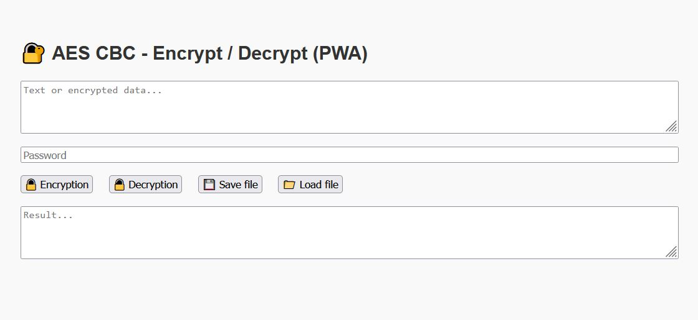

## Description ##

AES CBC Text Encryptor (PWA)

This is a lightweight Progressive Web App (PWA) built with HTML, JavaScript, and CryptoJS that allows users to encrypt and decrypt text using the AES encryption algorithm in CBC mode with SHA-256 password hashing. It supports:

*    AES encryption/decryption in CBC mode with PKCS7 padding
*   Password-based key derivation using SHA-256
*    Random IV generation per encryption
*   Saving encrypted/decrypted results as .txt files
*    Loading input text from files
*    Offline functionality via service worker (PWA support)

Ideal for simple text protection tasks that can run entirely in the browser, even without internet access.

### 🔧 How to Use

#### 🔹 Open the App
Just open `index.html` in your browser, or deploy it online to benefit from full PWA functionality.

#### 🔹 Encrypt Text
- Type or paste your plain text into the top textarea.
- Enter your password in the password field.
- Click 🔒 **Encrypt**.
- The encrypted result will appear in the output field (Base64-encoded).

#### 🔹 Decrypt Text
- Paste the encrypted Base64 string into the top textarea.
- Enter the password used for encryption.
- Click 🔓 **Decrypt** to reveal the original text.

#### 🔹 Save to File
- After encryption or decryption, click 💾 **Save** to download the result as a `.txt` file.

#### 🔹 Load from File
- Click 📁 **Load File** to upload a text file. Its contents will be loaded into the input field.

#### 🔹 Install as PWA
- If accessed from a browser that supports PWAs, you can install it to your device for offline use.

> ⚠️ **Note:** Always remember your password. Encrypted data cannot be recovered without the correct key.

